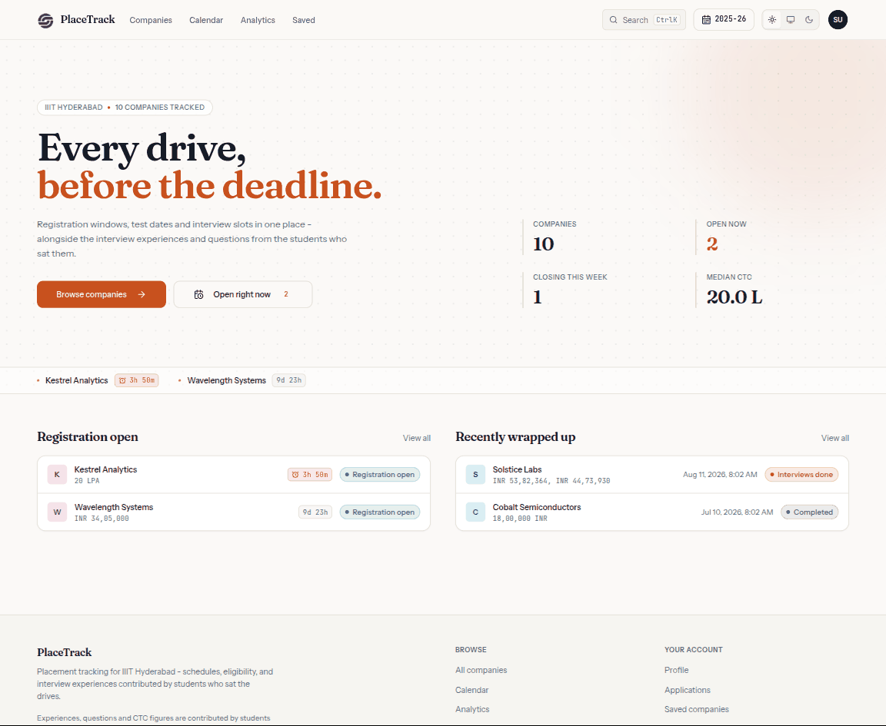
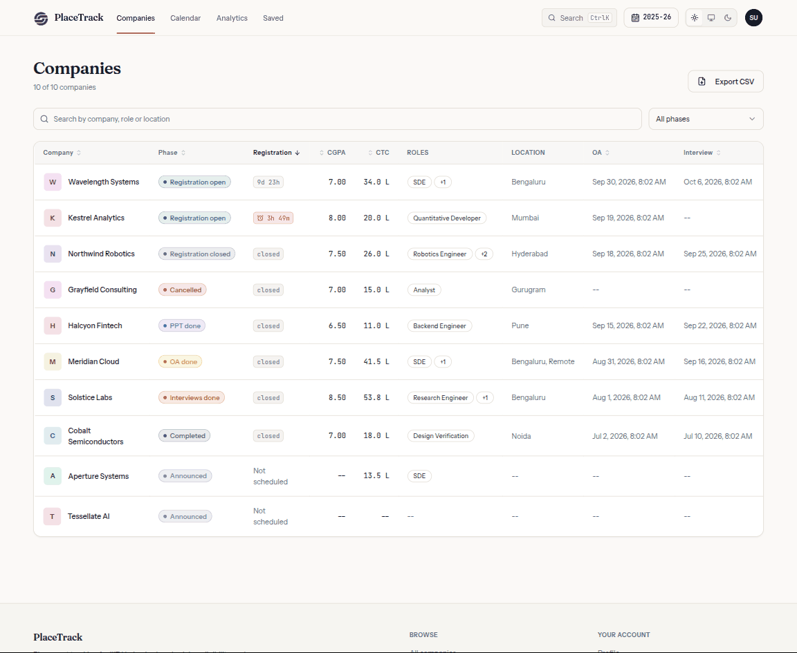
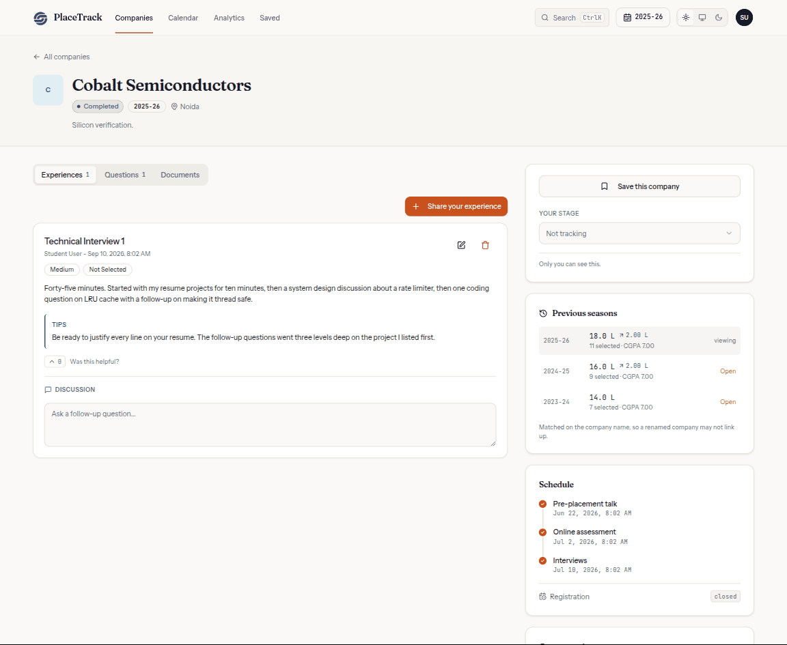
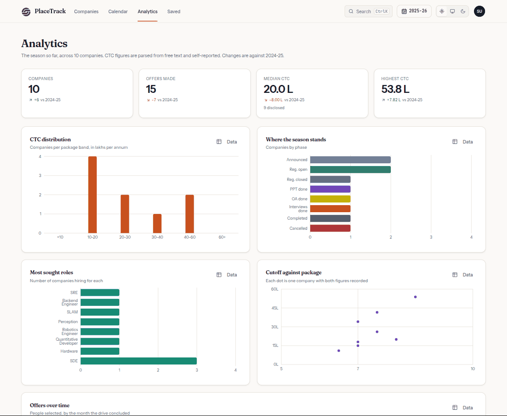
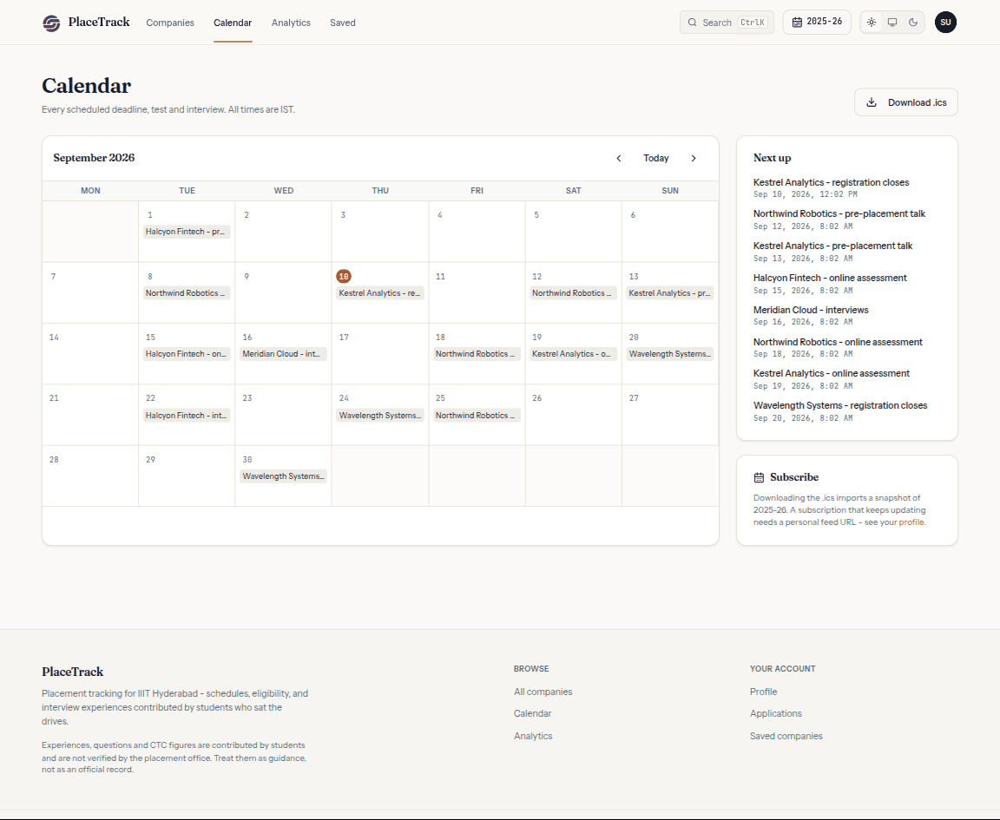
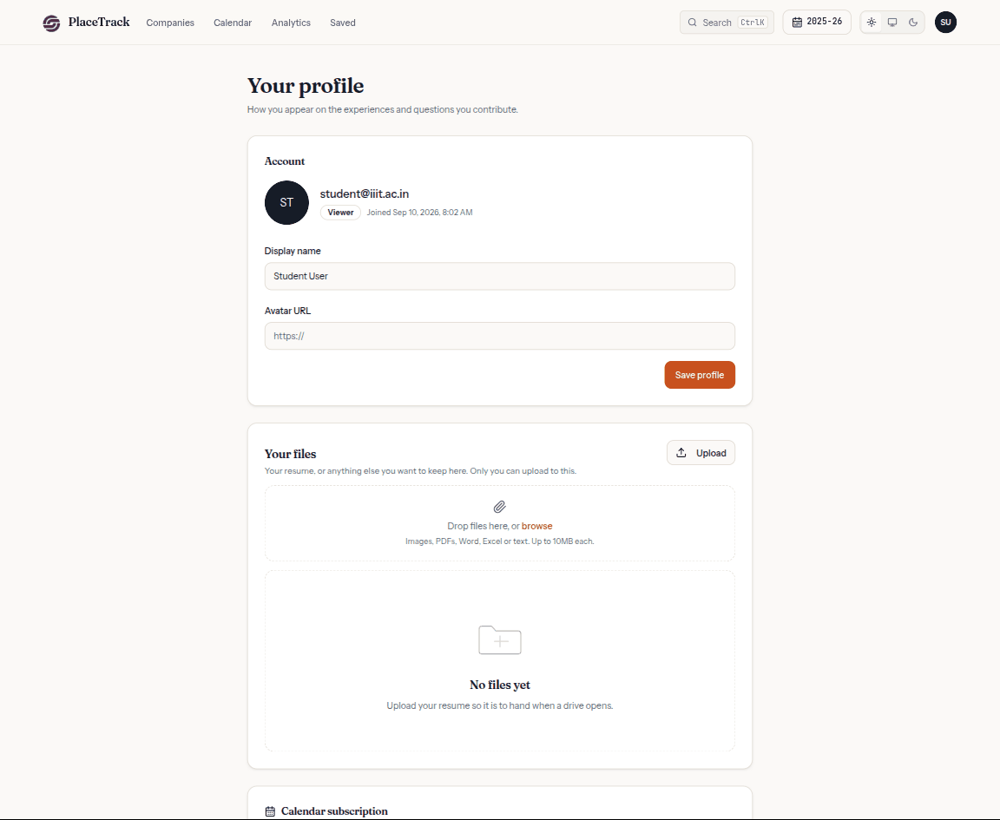
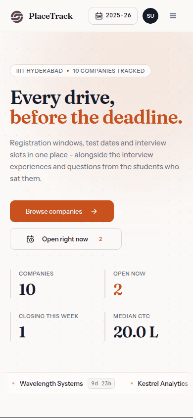
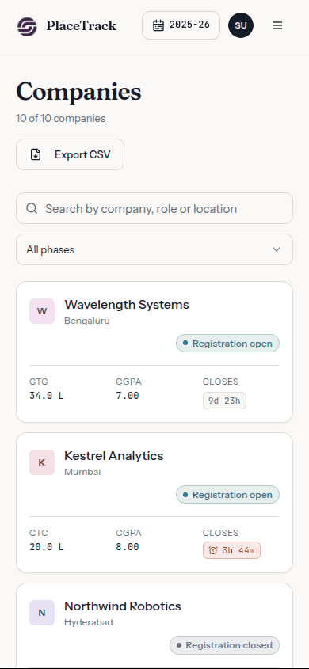
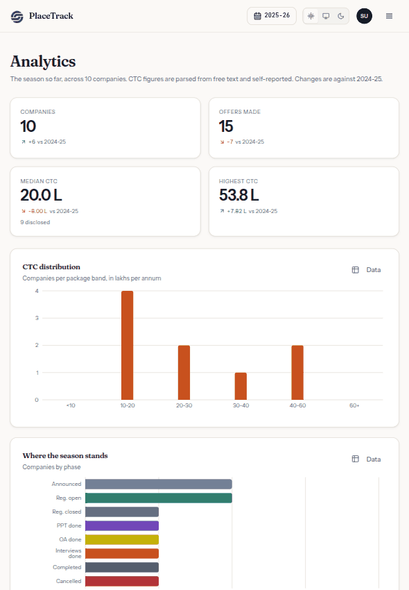

<!-- Generated from README.md by scripts/build-light-readme.mjs. Do not edit by hand. -->

<div align="center">

<picture>
  <source media="(prefers-color-scheme: dark)" srcset="./docs/assets/adk_dev_logo_light.png">
  
</picture>

# PlaceTrack

**Placement tracking for IIIT Hyderabad. Companies, schedules, eligibility, and the interview experiences and questions students contribute after each drive.**


<br>


<br><br>

[](https://github.com/Dileepadari/placement-navigator/actions/workflows/ci.yml)

**Live:** [placements.dileepadari.dev](https://placements.dileepadari.dev) &middot; **[Developer documentation](./DEVDOC.md)** &middot; [Screenshots](#screenshots)

<p><b>Light mode</b> &middot; <a href="./README.md">View this page in dark mode</a></p>

</div>

---

Built for IIIT Hyderabad students, for internal use.

## Contents

- [Why this project matters](#why-this-project-matters)
- [Screenshots](#screenshots)
- [Responsive layout](#responsive-layout)
- [What it does](#what-it-does)
- [Stack](#stack)
- [Getting started](#getting-started)
- [Scripts](#scripts)
- [Database](#database)
- [Contributors](#contributors)
- [Contributing](#contributing)
- [License](#license)

---

## Why this project matters

Placement season runs on rumour. A registration deadline is announced in one
WhatsApp group, the CGPA cutoff in another, and what the interview was actually
like exists only in the memory of whoever sat it last year. Miss the message and
you miss the drive.

PlaceTrack puts the schedule and the eligibility in one place, and then does the
harder half: it keeps the **interview experiences and questions** from the
students who sat each drive, attached to the company they belong to, so next
year's batch reads them instead of asking around.

The design decision worth naming is that **the whole site is an archive as well
as a noticeboard**. A season selector scopes every page, so 2023-24 can be read
exactly as it stood, and a company page shows what that employer paid and how
many it took in each previous year. A noticeboard that forgets is only useful for
a fortnight.

## Screenshots

Real 1440x1180 viewport renders against a local Supabase stack with the seed data
from `supabase/seed.sql`. This page shows **light mode**; the same gallery in
dark mode is at **[README.md](./README.md)**.

<table>
  <tr>
    <td width="33%" valign="top">
      
      <p align="center"><b>Home</b><br><sub>What is open now, what closes this week, what just finished.</sub></p>
    </td>
    <td width="33%" valign="top">
      
      <p align="center"><b>Companies</b><br><sub>Every drive in one table, sortable, filterable, exportable.</sub></p>
    </td>
    <td width="33%" valign="top">
      
      <p align="center"><b>A company</b><br><sub>The write-up from someone who sat it, and the season history.</sub></p>
    </td>
  </tr>
  <tr>
    <td width="33%" valign="top">
      
      <p align="center"><b>Analytics</b><br><sub>The season in numbers, compared against the one before.</sub></p>
    </td>
    <td width="33%" valign="top">
      
      <p align="center"><b>Calendar</b><br><sub>Every deadline and slot, exportable to your own calendar.</sub></p>
    </td>
    <td width="33%" valign="top">
      
      <p align="center"><b>Profile</b><br><sub>Your name on contributions, your files, your calendar feed.</sub></p>
    </td>
  </tr>
</table>

## Responsive layout

Most of this gets read on a phone between lectures. Each of these is a single
render at that exact viewport, not a scaled-down desktop shot.

<table>
  <tr>
    <td width="28%" valign="top">
      
      <p align="center"><b>Phone, 390x844</b><br><sub>The season summary stacks; the ticker keeps scrolling.</sub></p>
    </td>
    <td width="28%" valign="top">
      
      <p align="center"><b>Phone, companies</b><br><sub>The table becomes cards rather than scrolling sideways.</sub></p>
    </td>
    <td width="44%" valign="top">
      
      <p align="center"><b>Tablet, 820x1180</b><br><sub>Stat tiles go two-up; every chart keeps its axis labels.</sub></p>
    </td>
  </tr>
</table>

## What it does

- **Seasons** - the whole site is an archive as well as a noticeboard. A year
  selector in the header scopes every page, so you can read 2023-24 exactly as it
  stood, and each company page shows what that employer paid and how many it took
  in previous years. Seasons run August to July.
- **Companies** - the drive calendar: registration deadlines, PPT / OA / interview
  slots, CGPA cutoffs, CTC breakdowns, roles, bond terms, and how many people were
  selected. Sortable and filterable, with imminent deadlines called out.
- **Interview experiences** - round-by-round writeups contributed by students who
  sat the drive, with difficulty, outcome, and tips.
- **Interview questions** - a question bank per company, tagged by topic and type.
- **Documents** - JDs, offer letters, OA question papers and feedback forms, stored
  on a self-hosted CDN (see [DEVDOC.md](./DEVDOC.md#file-storage)).
- **Roles** - `viewer` reads, `editor` maintains company data, `admin` also manages
  users. Enforced by Postgres row-level security, not just the UI.

## Stack

| | |
|---|---|
| Frontend | React 18, TypeScript, Vite, React Router 6 |
| UI | Tailwind CSS, shadcn/ui, Radix primitives |
| Data | Supabase (Postgres + PostgREST + GoTrue), TanStack Query |
| Forms | react-hook-form + zod |
| File storage | Self-hosted CDN at `mystorage.dileepadari.dev` via a Supabase Edge Function |
| Hosting | Vercel |

## Getting started

Requires Node 22+.

```sh
git clone git@github.com:Dileepadari/placement-navigator.git
cd placement-navigator
npm install
cp .env.example .env    # then fill it in - see below
npm run dev             # http://localhost:8080
```

### Environment

`.env` needs three browser-side values to run the app:

```sh
VITE_SUPABASE_PROJECT_ID="..."
VITE_SUPABASE_URL="https://<ref>.supabase.co"
VITE_SUPABASE_ANON_KEY="..."
```

The anon key is public by design - it ships in the JS bundle, and row-level
security is what actually protects the data. Three further values
(`SUPABASE_ACCESS_TOKEN`, `SUPABASE_DB_PASSWORD`, `SUPABASE_SERVICE_ROLE_KEY`)
are only needed to run migrations or deploy edge functions; they have no `VITE_`
prefix, so they are never bundled. [DEVDOC.md](./DEVDOC.md#environment) says where
each one comes from.

## Scripts

| Script | Does |
|---|---|
| `npm run dev` | Dev server on :8080 |
| `npm run build` | Production build |
| `npm run lint` | ESLint |
| `npm run typecheck` | `tsc --noEmit` |
| `npm test` | Unit and component tests |
| `npm run db:push` | Apply migrations to the linked project |
| `npm run fn:deploy` | Deploy the `placements` edge function |

## Database

Migrations live in `supabase/migrations/` and are applied in filename order.
`supabase/backups/` holds dumps taken before schema changes. It is gitignored:
those files contain real emails and password hashes.

```sh
npm run db:push      # apply to the linked project
```

There are no generated database types. The browser never talks to PostgREST -
every request goes through the `placements` edge function - so the types that
matter are the hand-written API shapes in `src/types/database.ts` and
`src/lib/api.ts`. Change a column and you change those by hand, deliberately.
See [supabase/README.md](./supabase/README.md) for how to add a migration safely.

## Contributors

<table>
  <tr>
    <td align="center">
      <a href="https://github.com/Dileepadari">
        
        <br><sub><b>Dileep Adari</b></sub>
      </a>
      <br><sub>Author and maintainer</sub>
    </td>
    <td align="center">
      <a href="https://github.com/Delhiproject0">
        
        <br><sub><b>Delhiproject0</b></sub>
      </a>
      <br><sub>Upstream repository owner</sub>
    </td>
  </tr>
</table>

The experiences, questions and CTC figures on the live site are contributed by
IIIT Hyderabad students. They are not verified by the placement office.

## Contributing

Branch off `main`, open a PR. See [CONTRIBUTING.md](./CONTRIBUTING.md).

CI runs three jobs and all must pass:

- **web** - lint, typecheck, the unit tests and the production build.
- **functions** - `deno check` over the edge function.
- **api** - starts a real Supabase stack and runs `tests/api` against it. These
  cover the authorization checks that stand in for row-level security, and they
  skip themselves locally when no stack is listening, so this job is the only
  place they are guaranteed to run.

If you change `README.md`, regenerate its light-mode twin so the pair stays in
sync:

```bash
node scripts/build-light-readme.mjs
```

## License

MIT. See [LICENSE](./LICENSE).
